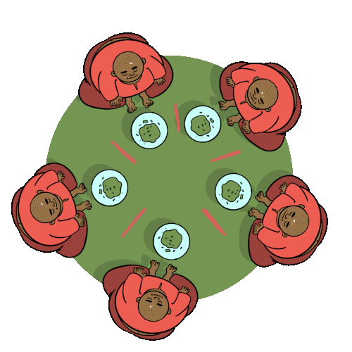
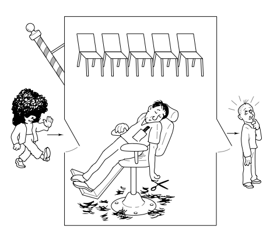

Urbino`s University - Applied computer science - Operative Systems  

# Classic-synchronizzazion-problems
Classical problems of synchronization using Semaphores and Condition Variables in java

# Problems Solved:
### Dining Philosophers
>
>* Solved using Semaphores.
>* Solved using Condition Variables.

### Producer Consumer
>
>* Solved using Semaphores.
>* Solved using Condition Variables.

### Readers and Writers
>
>* Solved using Semaphores.
>* Solved using Condition Variables.

### Sleeping Barber
>
>* Solved using Semaphores.
>* Solved using Condition Variables.
